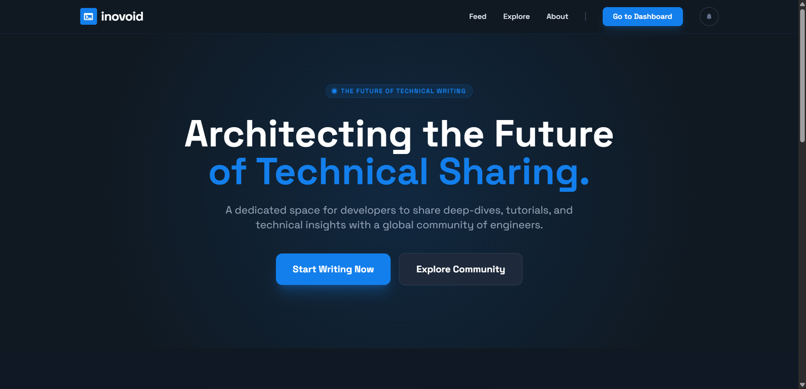
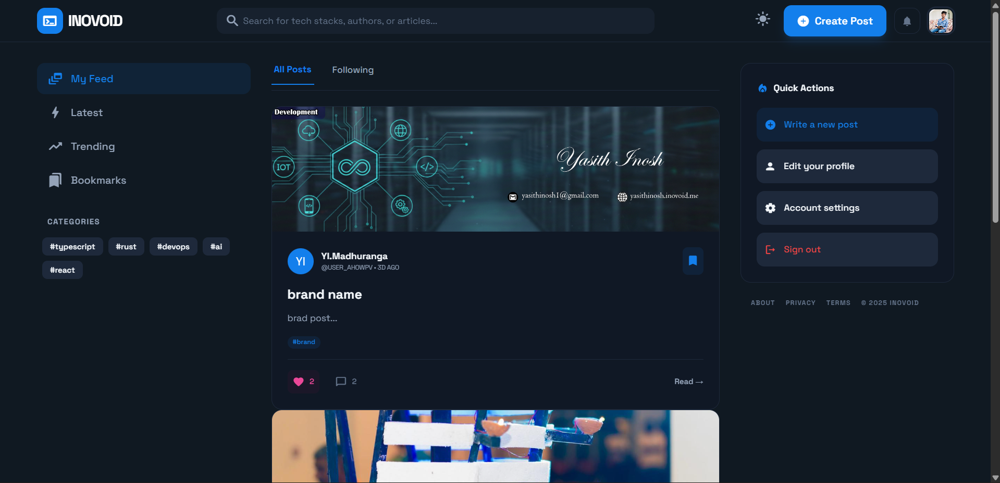
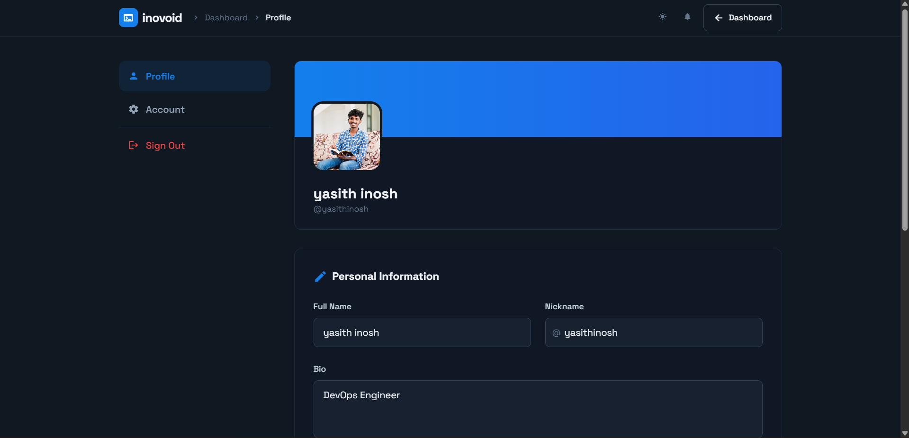

<div align="center">


# Inovoid

### A Modern Technical Blogging Platform

[](https://delightful-mud-06427dc00.azurestaticapps.net)
[](https://supabase.com)
[](https://tailwindcss.com)
[](https://developer.mozilla.org/en-US/docs/Web/JavaScript)


A dedicated space for developers to share deep-dives, tutorials, and technical insights with a global community of engineers. No paywalls, no clutter — just pure engineering.

[**🌐 Live Demo**](https://delightful-mud-06427dc00.azurestaticapps.net) · [**📋 Report a Bug**](../../issues) · [**💡 Request a Feature**](../../issues)

</div>

---

## 📸 Screenshots

> **How to add screenshots:** Take screenshots of each page, save them to `docs/screenshots/`, then replace the placeholder blocks below.

### Landing Page
<!-- Replace this block with:  -->
```
📷  docs/screenshots/landing.png
     → Landing page hero section (dark/light mode)
```

### Feed / Dashboard
<!-- Replace this block with:  -->
```
📷  docs/screenshots/feed.png
     → Main blog post feed with post cards
```

### Post View
<!-- Replace this block with:  -->
```
📷  docs/screenshots/post.png
     → Single post view with comments and reactions
```

### Create Post
<!-- Replace this block with:  -->
```
📷  docs/screenshots/create.png
     → Rich text editor for writing new blog posts
```

### User Profile
<!-- Replace this block with:  -->
```
📷  docs/screenshots/profile.png
     → User profile page with avatar, bio, and posts
```

### Bookmarks
<!-- Replace this block with:  -->
```
📷  docs/screenshots/bookmarks.png
     → Saved/bookmarked posts collection
```

### Settings
<!-- Replace this block with:  -->
```
📷  docs/screenshots/settings.png
     → Account settings with dark/light theme toggle
```

---

## ✨ Features

| Feature | Description |
|---|---|
| 🔐 **Authentication** | Email/password signup with verification, login, and password reset |
| 📝 **Rich Post Editor** | Create and publish blog posts with cover images and formatting |
| 💬 **Threaded Comments** | Nested comment replies for in-depth discussions |
| ❤️ **Reactions** | Like, love, and fire emoji reactions on posts and comments |
| 🔔 **Notifications** | Real-time notification bell for new activity on your posts |
| 🔖 **Bookmarks** | Save posts to read later in your personal bookmark collection |
| 👤 **User Profiles** | Avatar, bio, nickname, and a showcase of published posts |
| ⚙️ **Account Settings** | Change password and manage privacy preferences |
| 🌗 **Dark / Light Mode** | Persistent theme toggle with smooth transitions |
| 📱 **Responsive Design** | Mobile-first layout with a bottom navigation bar |

---

## 🛠️ Tech Stack

| Layer | Technology | Purpose |
|---|---|---|
| **Frontend** | HTML5, CSS3, JavaScript (ES6+) | Core structure and logic |
| **Styling** | Tailwind CSS (CDN) | Utility-first, responsive styling |
| **Typography** | Space Grotesk (Google Fonts) | Modern, developer-friendly typeface |
| **Icons** | Material Icons | Consistent icon set |
| **Backend / BaaS** | [Supabase](https://supabase.com) | Authentication, PostgreSQL database, file storage |
| **Deployment** | Azure Static Web Apps | CI/CD via GitHub Actions on every push to `main` |

---

## 🗂️ Project Structure

```
techBlog/
├── .github/
│   └── workflows/
│       └── azure-static-web-apps-*.yml   # Azure CI/CD pipeline
├── docs/
│   ├── schema.sql                         # Main database schema
│   ├── add_comment_replies.sql            # Migration: threaded replies
│   ├── bookmarks.sql                      # Migration: bookmarks feature
│   ├── comment_reactions.sql              # Migration: comment reactions
│   ├── notifications.sql                  # Migration: notifications system
│   └── screenshots/                       # ← Add your screenshots here
├── stitch_assets/                         # Original design references
├── web/                                   # 📁 Deployable static site root
│   ├── index.html                         # Landing / marketing page
│   ├── staticwebapp.config.json           # Azure routing rules
│   ├── assets/
│   │   ├── favicon.svg
│   │   └── images/
│   ├── css/
│   │   └── main.css                       # Shared custom styles & animations
│   ├── js/
│   │   ├── config.js                      # Supabase URL & anon key (not committed)
│   │   ├── supabase.js                    # Database client & CRUD helpers
│   │   ├── auth.js                        # Auth guards & session utilities
│   │   ├── notifications.js               # Real-time notification logic
│   │   └── theme.js                       # Dark/light theme persistence
│   └── pages/
│       ├── signup.html                    # User registration
│       ├── login.html                     # User login
│       ├── feed.html                      # Blog post feed / dashboard
│       ├── post.html                      # Single post view (comments + reactions)
│       ├── create.html                    # Create / edit posts
│       ├── profile.html                   # Public user profile
│       ├── bookmarks.html                 # Saved posts
│       ├── settings.html                  # Account settings
│       └── comments.html                  # Comment thread view
├── .env                                   # Local env variables (not committed)
├── .gitignore
└── README.md
```

---

## 🚀 Quick Start

### Prerequisites

- A free [Supabase](https://supabase.com) account
- Any static file server (or just open `index.html` in a browser)

### 1. Clone the Repository

```bash
git clone https://github.com/<your-username>/techBlog.git
cd techBlog
```

### 2. Set Up the Database

1. Create a new project at [supabase.com](https://supabase.com).
2. Go to **SQL Editor** and run the files in this order:
   ```
   docs/schema.sql
   docs/add_comment_replies.sql
   docs/bookmarks.sql
   docs/comment_reactions.sql
   docs/notifications.sql
   ```

### 3. Configure Credentials

Edit `web/js/config.js` with your Supabase project credentials:

```js
const SUPABASE_URL = 'https://your-project-id.supabase.co';
const SUPABASE_ANON_KEY = 'your-anon-key';
```

> ⚠️ **Never commit `config.js` or `.env` to a public repository.**

### 4. Run Locally

```bash
cd web
npx -y serve . -l 3000
```

Then open [http://localhost:3000](http://localhost:3000) in your browser.

---

## ☁️ Deployment (Azure Static Web Apps)

This project auto-deploys to **Azure Static Web Apps** via GitHub Actions on every push to the `main` branch.

| Step | Description |
|---|---|
| **1** | Push code to `main` branch |
| **2** | GitHub Actions triggers the workflow in `.github/workflows/` |
| **3** | Azure Static Web Apps deploys `./web` as the app root |

To deploy your own instance:
1. Create an Azure Static Web App resource in the [Azure Portal](https://portal.azure.com).
2. Link it to your GitHub repository.
3. Add your Supabase credentials as GitHub repository secrets or environment variables.

---

## 🗄️ Database Schema Overview

The Supabase PostgreSQL database includes the following main tables:

| Table | Purpose |
|---|---|
| `profiles` | User profiles — avatar, bio, nickname |
| `posts` | Blog posts — title, content, cover image, published status |
| `comments` | Comments & threaded replies on posts |
| `reactions` | Emoji reactions (like / love / fire) on posts |
| `comment_reactions` | Emoji reactions on individual comments |
| `bookmarks` | User-saved post bookmarks |
| `notifications` | Activity notifications (comments, reactions, replies) |

---

## 🤝 Contributing

Contributions, issues, and feature requests are welcome!

1. Fork the project.
2. Create a feature branch: `git checkout -b feature/amazing-feature`
3. Commit your changes: `git commit -m 'feat: add amazing feature'`
4. Push to the branch: `git push origin feature/amazing-feature`
5. Open a Pull Request.

---

## 📄 License

© 2025 **inovoid**. All rights reserved.

---

<div align="center">
  Made with ❤️ for the developer community
</div>
